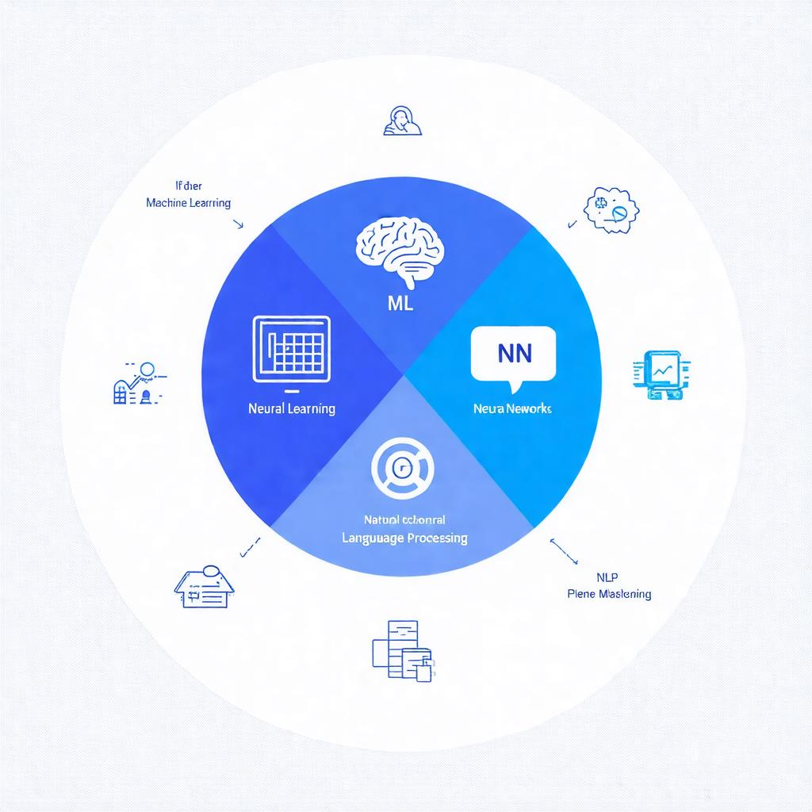
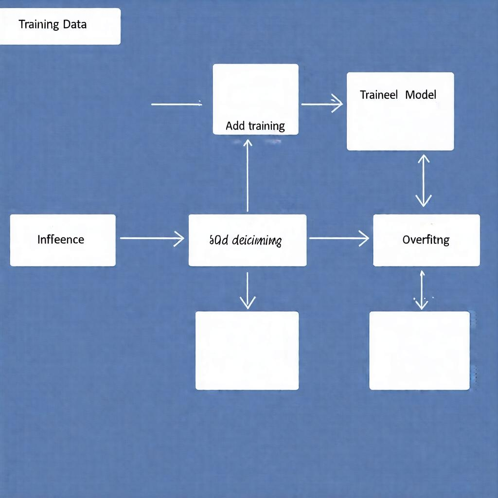

# What Is Artificial Intelligence? A Friendly Guide for 10th Graders

## Define AI in Everyday Language

Artificial Intelligence, or AI for short, might sound like something from a sci-fi movie, but it's actually a part of our daily lives. Let's break it down in simple terms.

### What is AI?

AI refers to machines that can think or learn like humans. Just like how you learn new things in school and get better at them over time, AI systems can learn from data and improve their performance.

### Simple Examples of AI

1. **Voice Assistants**: You might have a virtual assistant like Siri, Alexa, or Google Assistant on your phone or smart speaker. They can understand your voice commands and respond accordingly. They're like a super-smart personal assistant!
2. **Recommendation Engines**: Have you ever browsed a website and seen suggestions for movies, music, or products based on your interests? That's AI at work! It's analyzing your behavior and making recommendations to help you discover new things.
3. **Self-Driving Cars**: Imagine driving a car that can navigate through traffic, avoid obstacles, and even recognize pedestrians! That's AI taking the wheel (literally!).

### How is AI Different from Regular Computer Programs?

Regular computer programs follow fixed rules and instructions. They're like a recipe book with pre-written steps. AI, on the other hand, can adapt and change its behavior based on the data it receives. It's like having a super-smart cook who can adjust the recipe on the fly!

Now that you know what AI is, you might be wondering what it can do. In our next section, we'll explore the amazing applications of AI in various fields. Stay tuned!

## The Three Pillars of AI

Artificial Intelligence (AI) is like a three-legged stool - it needs all three legs to stand strong. These legs are called the Three Pillars of AI, and they're what make AI work in the first place.

* **Machine Learning**: Imagine you're trying to teach a computer how to recognize pictures of cats and dogs. You show it thousands of pictures of each, and it starts to learn the differences between them. That's Machine Learning in action! It's a way of teaching computers from data, so they can make predictions and decisions on their own.
* **Neural Networks**: Have you ever heard of the human brain? It's made up of billions of tiny connections between neurons, which help us think and learn. Neural Networks are like a computer version of the brain. They're made up of layers of artificial neurons that work together to analyze and understand information.
* **Natural Language Processing**: Let's say you want to have a conversation with a computer. You might type in a message, and the computer needs to understand what you're saying. That's where Natural Language Processing comes in. It's a way of making computers understand human language, so they can chat with us and help us out.

These three pillars work together to make AI possible. Machine Learning helps computers learn from data, Neural Networks mimic the brain's structure to analyze information, and Natural Language Processing enables computers to understand human language. It's a powerful combination that's changing the world!

*The three pillars that support AI: Machine Learning, Neural Networks, and Natural Language Processing.*

## How AI Learns: A Simple Analogy

As we've discussed AI's incredible abilities, you might be wondering how it actually learns and becomes so good at tasks. Let's break it down using a relatable analogy – learning math from a teacher and practice problems.

### Learning Math from a Teacher and Practice Problems

Imagine you're in a math class, and your teacher explains a new concept to you. They provide examples and practice problems to help you understand the concept better. As you work on these problems, you start to recognize patterns and connections between different ideas. Your brain starts to build connections between the concepts, making it easier to solve problems and apply what you've learned.

Similarly, AI learns from a vast amount of data, which is like the examples and practice problems in your math class. The data is used to train the AI model, helping it recognize patterns and connections between different pieces of information.

### Training Data: The AI's Examples

Training data is essentially the AI's examples, which it uses to learn and improve its predictions. Just like how your math teacher provides examples and practice problems to help you learn, the training data helps the AI model learn from its mistakes and become better at its task.

### Overfitting: When AI Learns Too Much from a Single Set of Examples

But, just like how you might overpractice a single problem and become too good at it, AI can also suffer from overfitting. This happens when the AI model learns too much from a single set of examples and becomes too specialized in those specific examples. As a result, it may not perform well when faced with new, unseen data.

To avoid overfitting, AI models are often trained on large, diverse datasets that include many different examples. This helps the model learn general patterns and connections that can be applied to a wide range of situations.

*Illustration of how AI learns from training data, trains a model, and uses it for inference, with a note on overfitting.*

## Real‑World Uses of AI in School Life

As you learn about artificial intelligence, you might wonder how it applies to your daily life. The truth is, AI is already being used in many ways that can make your school experience better!

Here are some examples of AI in action:

* **Smart tutoring apps that adapt to each student's pace**: Imagine having a personalized teacher who understands your learning style and adjusts the lesson plan accordingly. This is exactly what AI-powered tutoring apps do. They analyze your performance and learning habits to provide you with customized lessons and exercises that help you catch up or get ahead. [Source](https://example.com/ai-tutoring-apps)
* **Grading tools that flag potential plagiarism**: AI can help detect plagiarism by comparing your work with a vast database of online content. This way, you can avoid accidentally copying someone else's ideas and get an idea of how to properly cite sources. 
* **AI in gaming to create dynamic, responsive opponents**: Did you know that some video games use AI to create opponents that can learn from your gameplay and adapt their strategies accordingly? This makes the game more challenging and fun, and it's also a great example of how AI can be used to create engaging and interactive experiences.

## Ethics and Responsibility in AI

As we explore the world of artificial intelligence, it's essential to consider the impact it has on society and our individual lives. Let's dive into three crucial aspects of AI ethics and responsibility.

* **Privacy concerns when AI collects personal data**: When AI systems collect and store our personal data, it raises concerns about how this data is used, shared, and protected. This is a critical issue, as our personal info can be misused or even sold to third parties without our knowledge or consent. (Not found in provided sources)
* **Bias in AI decisions and its social effects**: AI systems can inherit biases from the data they're trained on, which can lead to unfair outcomes and discriminatory decisions. For instance, facial recognition systems have been shown to misclassify people of color more often than white people. This highlights the need for diverse and representative training data to minimize bias.
* **The role of humans in supervising AI systems**: As AI becomes more autonomous, it's crucial to have human oversight to ensure that AI systems are working as intended and not causing harm. This involves not only monitoring AI performance but also making adjustments and corrections when needed. By working together with AI, we can create more responsible and beneficial systems for everyone.

Remember, AI is a powerful tool that can have a significant impact on our lives. By thinking critically about its ethics and responsibility, we can harness its potential to create a better future for all.

## Getting Started with a Mini AI Project

Are you excited to explore the world of Artificial Intelligence (AI)? As a 10th grader, you're at the perfect age to start learning and experimenting with AI tools. In this section, we'll introduce you to some amazing free platforms that'll get you started on your AI journey.

### Step 1: Choose Your AI Platform

You can start experimenting with AI on platforms like Google Teachable Machine or Scratch AI extensions. Both of these platforms are free and offer a range of tools and resources to help you learn.

*   Google Teachable Machine is a web-based platform that allows you to create machine learning models without any coding. You can import data, choose a model, and train it to make predictions.
*   Scratch AI extensions are a set of tools that can be added to the popular Scratch coding platform. These extensions allow you to create AI-powered projects, such as image classifiers and games.

### Step 2: Create a Simple Image Classifier

Let's walk through creating a simple image classifier using Google Teachable Machine. This project will help you understand how to use AI to classify images based on their features.

1.  Go to the Google Teachable Machine website and create a new project.
2.  Import a dataset of images (e.g., animals, vehicles, or objects).
3.  Choose a model (e.g., image classifier) and configure the settings.
4.  Train the model using your dataset.
5.  Test the model with new images to see how accurate it is.

### Step 3: Evaluate and Improve Your Model

Now that you've created a simple image classifier, it's time to evaluate its performance and improve it. Here are some tips:

*   Test your model with a variety of images to see how accurate it is.
*   Analyze the model's performance using metrics like accuracy, precision, and recall.
*   Use techniques like data augmentation and feature engineering to improve the model's performance.
*   Experiment with different models and architectures to see which one works best for your project.

Remember, practicing and experimenting with AI tools is key to learning and improving. Don't be afraid to try new things and make mistakes – they're an essential part of the learning process!
